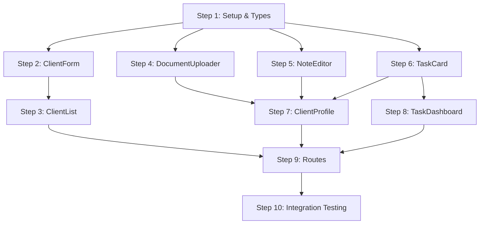

# Sequential Implementation Plan: Task 006

## Overview

Build mobile-first React components for client list (with search, infinite scroll), client profile (with tabs), and all sub-components for documents, notes, and tasks. This task follows TDD methodology - tests are written before implementation for each component.

## Implementation Steps

### Step 1: Project Setup & Feature Structure

**Objective**: Set up the client-hub feature directory structure and configure testing environment

**Actions**:
1. Create `src/features/client-hub/` directory structure:
   - `api/` - API service layer
   - `components/` - React components
   - `hooks/` - Custom hooks
   - `helpers/` - Utility functions
   - `types/` - TypeScript types
2. Create base TypeScript types for Client, ClientTag, ClientDocument, ClientNote, ClientTask
3. Set up API service file with Supabase client integration
4. Configure test setup (Vitest + React Testing Library if not already set up)

**Files**:
- `src/features/client-hub/types/index.ts`
- `src/features/client-hub/api/clientApi.ts`
- `src/features/client-hub/index.ts`
- `vitest.config.ts` (if needed)
- `src/test/setup.ts` (if needed)

**Agent Type**: general-purpose
**Skills**: frontend-development
**Estimated Hours**: 1.5h
**Prerequisites**: none

**Completion Criteria**:
- [ ] Feature directory structure created
- [ ] TypeScript types defined for all entities
- [ ] API service skeleton created with proper types
- [ ] Test configuration verified working

---

### Step 2: ClientForm Tests & Implementation

**Objective**: Build the ClientForm component with Zod validation using TDD

**Actions**:
1. Write tests for ClientForm:
   - Renders all form fields (name, email, phone, birthday, address)
   - Validates required fields (name, email, phone)
   - Validates email format
   - Validates phone format (+1-XXX-XXX-XXXX)
   - Calls onSubmit with valid data
   - Shows validation errors
   - Pre-fills data when editing existing client
2. Implement ClientForm with react-hook-form + Zod
3. Style for mobile-first (full-screen modal, keyboard-aware)
4. Run tests to verify all passing

**Files**:
- `src/features/client-hub/components/ClientForm/ClientForm.test.tsx`
- `src/features/client-hub/components/ClientForm/ClientForm.tsx`
- `src/features/client-hub/components/ClientForm/clientFormSchema.ts`
- `src/features/client-hub/components/ClientForm/index.ts`

**Agent Type**: general-purpose
**Skills**: frontend-development, ui-styling
**Estimated Hours**: 2h
**Prerequisites**: Step 1 must be complete

**Completion Criteria**:
- [ ] All ClientForm tests written before implementation
- [ ] All tests passing
- [ ] Form validates according to API requirements
- [ ] Mobile responsive (375px+)

---

### Step 3: ClientList Tests & Implementation

**Objective**: Build the ClientList component with infinite scroll and search using TDD

**Actions**:
1. Write tests for ClientList:
   - Renders list of clients
   - Shows loading state via Suspense
   - Implements infinite scroll (loads more on scroll)
   - Search input debounces at 300ms
   - Tag filtering with chips
   - Sort options (created_at, name)
   - Mobile card layout with 44x44px touch targets
   - Shows empty state when no clients
2. Implement ClientList with React Query infinite query
3. Create ClientCard sub-component for list items
4. Style mobile-first with touch-friendly targets
5. Run tests to verify all passing

**Files**:
- `src/features/client-hub/components/ClientList/ClientList.test.tsx`
- `src/features/client-hub/components/ClientList/ClientList.tsx`
- `src/features/client-hub/components/ClientList/ClientCard.tsx`
- `src/features/client-hub/components/ClientList/ClientCard.test.tsx`
- `src/features/client-hub/hooks/useClientsInfinite.ts`
- `src/features/client-hub/components/ClientList/index.ts`

**Agent Type**: general-purpose
**Skills**: frontend-development, ui-styling
**Estimated Hours**: 2.5h
**Prerequisites**: Steps 1, 2 must be complete

**Completion Criteria**:
- [ ] All ClientList tests written before implementation
- [ ] Infinite scroll working correctly
- [ ] Search debounced at 300ms
- [ ] Tag filtering functional
- [ ] All tests passing
- [ ] Touch targets minimum 44x44px

---

### Step 4: DocumentUploader Tests & Implementation

**Objective**: Build the DocumentUploader component with drag-drop and progress using TDD

**Actions**:
1. Write tests for DocumentUploader:
   - Renders drag-drop zone
   - Validates file types (PDF, DOC, DOCX, JPG, PNG)
   - Validates file size (max 10MB)
   - Shows upload progress
   - Handles multiple files
   - Calls onUpload callback on success
   - Shows error for invalid files
   - Camera/file picker integration (mobile)
2. Implement DocumentUploader with Supabase Storage
3. Style for mobile with camera integration
4. Run tests to verify all passing

**Files**:
- `src/features/client-hub/components/DocumentUploader/DocumentUploader.test.tsx`
- `src/features/client-hub/components/DocumentUploader/DocumentUploader.tsx`
- `src/features/client-hub/components/DocumentUploader/DocumentList.tsx`
- `src/features/client-hub/components/DocumentUploader/index.ts`
- `src/features/client-hub/hooks/useDocumentUpload.ts`

**Agent Type**: general-purpose
**Skills**: frontend-development, ui-styling
**Estimated Hours**: 1.5h
**Prerequisites**: Step 1 must be complete

**Completion Criteria**:
- [ ] All DocumentUploader tests written before implementation
- [ ] File type validation working
- [ ] File size validation working
- [ ] Progress indicator showing
- [ ] All tests passing

---

### Step 5: NoteEditor Tests & Implementation

**Objective**: Build the NoteEditor component with importance toggle using TDD

**Actions**:
1. Write tests for NoteEditor:
   - Renders text area for note content
   - Shows importance star toggle
   - Validates non-empty content
   - Calls onSubmit with content and is_important
   - Pre-fills when editing existing note
   - Auto-save draft (optional)
2. Implement NoteEditor with controlled textarea
3. Style importance toggle (star icon)
4. Run tests to verify all passing

**Files**:
- `src/features/client-hub/components/NoteEditor/NoteEditor.test.tsx`
- `src/features/client-hub/components/NoteEditor/NoteEditor.tsx`
- `src/features/client-hub/components/NoteEditor/NoteList.tsx`
- `src/features/client-hub/components/NoteEditor/index.ts`

**Agent Type**: general-purpose
**Skills**: frontend-development
**Estimated Hours**: 1h
**Prerequisites**: Step 1 must be complete

**Completion Criteria**:
- [ ] All NoteEditor tests written before implementation
- [ ] Importance toggle functional
- [ ] Content validation working
- [ ] All tests passing

---

### Step 6: TaskCard Tests & Implementation

**Objective**: Build the TaskCard component with color-coded priority/due date using TDD

**Actions**:
1. Write tests for TaskCard:
   - Renders task title, description, due date
   - Shows color-coded priority (low=gray, medium=blue, high=red)
   - Shows overdue indicator (red if past due)
   - Shows today indicator (yellow if due today)
   - Quick status toggle (checkbox)
   - Swipe actions for complete/delete (mobile)
   - Calls onStatusChange when toggled
2. Implement TaskCard with visual indicators
3. Style with priority colors and due date highlighting
4. Run tests to verify all passing

**Files**:
- `src/features/client-hub/components/TaskCard/TaskCard.test.tsx`
- `src/features/client-hub/components/TaskCard/TaskCard.tsx`
- `src/features/client-hub/components/TaskCard/TaskList.tsx`
- `src/features/client-hub/components/TaskCard/index.ts`
- `src/features/client-hub/helpers/taskHelpers.ts`

**Agent Type**: general-purpose
**Skills**: frontend-development, ui-styling
**Estimated Hours**: 1.5h
**Prerequisites**: Step 1 must be complete

**Completion Criteria**:
- [ ] All TaskCard tests written before implementation
- [ ] Priority color coding working
- [ ] Due date indicators (overdue=red, today=yellow) working
- [ ] Status toggle functional
- [ ] All tests passing

---

### Step 7: ClientProfile Tests & Implementation

**Objective**: Build the ClientProfile component with tabs for Overview, Documents, Notes, Tasks using TDD

**Actions**:
1. Write tests for ClientProfile:
   - Renders client info (name, email, phone, address, birthday)
   - Shows tab navigation (Overview, Documents, Notes, Tasks)
   - Overview tab shows client details and counts
   - Documents tab renders DocumentUploader
   - Notes tab renders NoteEditor and NoteList
   - Tasks tab renders TaskCard list
   - Mobile bottom tab navigation
   - Swipe between sections (mobile)
2. Implement ClientProfile with tab state management
3. Integrate sub-components from previous steps
4. Style mobile bottom tabs
5. Run tests to verify all passing

**Files**:
- `src/features/client-hub/components/ClientProfile/ClientProfile.test.tsx`
- `src/features/client-hub/components/ClientProfile/ClientProfile.tsx`
- `src/features/client-hub/components/ClientProfile/OverviewTab.tsx`
- `src/features/client-hub/components/ClientProfile/DocumentsTab.tsx`
- `src/features/client-hub/components/ClientProfile/NotesTab.tsx`
- `src/features/client-hub/components/ClientProfile/TasksTab.tsx`
- `src/features/client-hub/components/ClientProfile/index.ts`
- `src/features/client-hub/hooks/useClient.ts`

**Agent Type**: general-purpose
**Skills**: frontend-development, ui-styling
**Estimated Hours**: 2h
**Prerequisites**: Steps 1-6 must be complete

**Completion Criteria**:
- [ ] All ClientProfile tests written before implementation
- [ ] All 4 tabs functional
- [ ] Sub-components integrated correctly
- [ ] Mobile bottom tab navigation working
- [ ] All tests passing

---

### Step 8: TaskDashboard Tests & Implementation

**Objective**: Build the TaskDashboard component for agent task overview using TDD

**Actions**:
1. Write tests for TaskDashboard:
   - Shows all tasks across all clients
   - Filter by status (pending, completed)
   - Filter by priority (low, medium, high)
   - Group by due date (overdue, today, upcoming)
   - Shows client name for each task
   - Pull-to-refresh functionality (mobile)
   - Empty state when no tasks
2. Implement TaskDashboard with React Query
3. Create grouping/filtering logic
4. Style mobile list with pull-to-refresh
5. Run tests to verify all passing

**Files**:
- `src/features/client-hub/components/TaskDashboard/TaskDashboard.test.tsx`
- `src/features/client-hub/components/TaskDashboard/TaskDashboard.tsx`
- `src/features/client-hub/components/TaskDashboard/TaskGroup.tsx`
- `src/features/client-hub/components/TaskDashboard/index.ts`
- `src/features/client-hub/hooks/useAllTasks.ts`

**Agent Type**: general-purpose
**Skills**: frontend-development, ui-styling
**Estimated Hours**: 1.5h
**Prerequisites**: Steps 1, 6 must be complete

**Completion Criteria**:
- [ ] All TaskDashboard tests written before implementation
- [ ] Filtering by status and priority working
- [ ] Grouping by due date working
- [ ] All tests passing

---

### Step 9: Route Setup & Integration

**Objective**: Set up TanStack Router routes for client hub pages

**Actions**:
1. Create route files:
   - `/clients` - ClientList page
   - `/clients/:id` - ClientProfile page
   - `/tasks` - TaskDashboard page
2. Configure lazy loading for all feature components
3. Add Suspense boundaries with SuspenseLoader
4. Set up breadcrumb data in route loaders
5. Add navigation between routes

**Files**:
- `src/routes/clients/index.tsx`
- `src/routes/clients/$id/index.tsx`
- `src/routes/tasks/index.tsx`

**Agent Type**: general-purpose
**Skills**: frontend-development
**Estimated Hours**: 1h
**Prerequisites**: Steps 1-8 must be complete

**Completion Criteria**:
- [ ] All routes configured and working
- [ ] Lazy loading configured
- [ ] Suspense boundaries in place
- [ ] Navigation between pages working

---

### Step 10: Integration Testing & Mobile Verification

**Objective**: Run full test suite and verify mobile responsiveness

**Actions**:
1. Run complete test suite:
   - All unit tests passing
   - Check test coverage (target: >80%)
2. Verify mobile responsiveness:
   - Test at 375px (iPhone SE)
   - Test at 390px (iPhone 12/13/14)
   - Test at 768px (iPad)
   - Test touch targets (44x44px minimum)
3. Fix any failing tests or responsive issues
4. Verify performance:
   - Client list load < 500ms for 100 clients
   - Search response < 300ms
   - Profile load < 2s
5. Document any deviations or notes

**Files**:
- All test files from previous steps
- Fix any files with issues

**Agent Type**: test-runner
**Skills**: frontend-development
**Estimated Hours**: 1.5h
**Prerequisites**: Steps 1-9 must be complete

**Completion Criteria**:
- [ ] All tests passing
- [ ] Test coverage > 80%
- [ ] Mobile responsive at 375px+
- [ ] Touch targets 44x44px verified
- [ ] Performance benchmarks met

## Execution Strategy

**Approach**: Linear, step-by-step TDD implementation

Each step follows TDD workflow:
1. Write failing tests first
2. Implement minimum code to pass tests
3. Refactor if needed
4. Verify all tests pass before moving on

This ensures:
- Clear dependencies are respected
- No file conflicts between steps
- Tests drive the implementation
- Quality gates enforced at each step

## Expected Timeline

Total implementation time: 16 hours

Step breakdown:
- Step 1 (Setup): 1.5h
- Step 2 (ClientForm): 2h
- Step 3 (ClientList): 2.5h
- Step 4 (DocumentUploader): 1.5h
- Step 5 (NoteEditor): 1h
- Step 6 (TaskCard): 1.5h
- Step 7 (ClientProfile): 2h
- Step 8 (TaskDashboard): 1.5h
- Step 9 (Routes): 1h
- Step 10 (Integration): 1.5h

## Component Dependency Graph

## Notes

- All components should use `useSuspenseQuery` for data fetching
- Use `SuspenseLoader` component for loading states (no early returns)
- Follow mobile-first responsive design approach
- Use MUI v7 Grid syntax: `<Grid size={{ xs: 12, md: 6 }}>`
- Import aliases: `@/`, `~types`, `~components`, `~features`
- Focus on test coverage - TDD is critical for this task
- Consider creating shared test utilities for common mocking patterns
